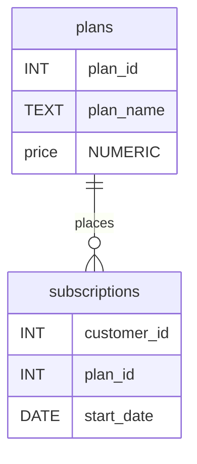
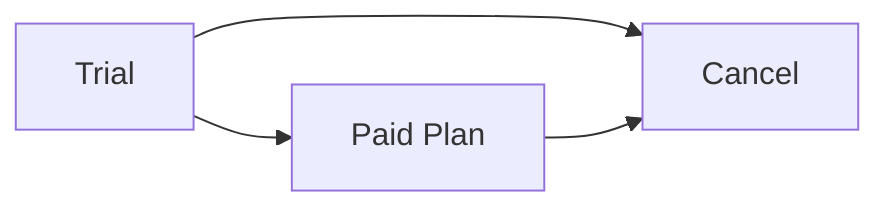

# Case Study #3 | Foodie-Fi


## Table of Contents

- [Problem Statement](#problem-statement)
- [Case Study Questions](#case-study-questions)
  - [A. Customer Journey](#a-customer-journey)
  - [B. Data Analysis Questions](#b-data-analysis-questions)
  - [C. Challenge Payment Question](#c-challenge-payment-question)
- [Links](#links)

## Problem Statement

Subscription based businesses are super popular and Danny realised that there was a large gap in the market - he wanted to create a new streaming service that only had food related content - something like Netflix but with only cooking shows!

Danny finds a few smart friends to launch his new startup Foodie-Fi in 2020 and started selling monthly and annual subscriptions, giving their customers unlimited on-demand access to exclusive food videos from around the world!

Danny created Foodie-Fi with a data driven mindset and wanted to ensure all future investment decisions and new features were decided using data. This case study focuses on using subscription style digital data to answer important business questions.

Danny has shared the data design for Foodie-Fi and also short descriptions on each of the database tables - our case study focuses on only 2 tables but there will be a challenge to create a new table for the Foodie-Fi team.



## Case Study Questions

### A. Customer Journey

Based on the 8 sample customers provided in the sample from the subscriptions table, write a brief description about each customer’s onboarding journey.

#### Solution

``` SQL
SELECT 
	s.customer_id,
	s.plan_id,
	p.plan_name,
	s.start_date
FROM subscriptions AS s
JOIN plans AS p
ON s.plan_id = p.plan_id
WHERE customer_id IN (
	1, 2, 11, 13, 15, 16, 18, 19
)
ORDER BY customer_id, plan_id;
```

| customer_id | plan_id |    plan_name    | start_date |
|:-----------:|:-------:|:---------------:|:----------:|
| 1           | 0       | trial           | 2020-08-01 |
| 1           | 1       | basic monthly   | 2020-08-08 |
| 2           | 0       | trial           | 2020-09-20 |
| 2           | 3       | pro annual      | 2020-09-27 |
| 11          | 0       | trial           | 2020-11-19 |
| 11          | 4       | churn           | 2020-11-26 |
| 13          | 0       | trial           | 2020-12-15 |
| 13          | 1       | basic monthly   | 2020-12-22 |
| 13          | 2       | pro monthly     | 2021-03-29 |
| 15          | 0       | trial           | 2020-03-17 |
| 15          | 2       | pro monthly     | 2020-03-24 |
| 15          | 4       | churn           | 2020-04-29 |
| 16          | 0       | trial           | 2020-05-31 |
| 16          | 1       | basic monthly   | 2020-06-07 |
| 16          | 3       | pro annual      | 2020-10-21 |
| 18          | 0       | trial           | 2020-07-06 |
| 18          | 2       | pro monthly     | 2020-07-13 |
| 19          | 0       | trial           | 2020-06-22 |
| 19          | 2       | pro monthly     | 2020-06-29 |
| 19          | 3       | pro annual      | 2020-08-29 |

From this table, it is clear that customers typically begin with a free trial. They then either choose a paid plan or cancel their subscription.



---

### B. Data Analysis Questions

#### 1. How many customers has Foodie-Fi ever had?
``` SQL
SELECT 
	COUNT(DISTINCT customer_id) AS customer_count
FROM subscriptions;
```
| customer_count |
|:--------------:|
| 1000           |

#### 2. What is the monthly distribution of trial plan start_date values for our dataset - use the start of the month as the group by value
``` SQL
SELECT
	date_trunc('month', start_date)::date AS month_starting,
	COUNT(customer_id) AS trials_started
FROM subscriptions
GROUP BY month_starting
ORDER BY month_starting;
```
| month_starting | trials_started |
|:--------------:|:--------------:|
| 2020-01-01	   | 159            |
| 2020-02-01	   | 148            |
| 2020-03-01	   | 200            |
| 2020-04-01	   | 184            |
| 2020-05-01	   | 214            |
| 2020-06-01	   | 204            |
| 2020-07-01	   | 221            |
| 2020-08-01	   | 235            |
| 2020-09-01	   | 225            |
| 2020-10-01	   | 230            |
| 2020-11-01	   | 208            |
| 2020-12-01	   | 220            |
| 2021-01-01	   | 77             |
| 2021-02-01	   | 47             |
| 2021-03-01	   | 45             |
| 2021-04-01     | 33             |

#### 3. What plan start_date values occur after the year 2020 for our dataset? Show the breakdown by count of events for each plan_name
``` SQL
SELECT
	p.plan_name,
	COUNT(s.customer_id) AS customers 
FROM subscriptions AS s
JOIN plans AS p
ON s.plan_id = p.plan_id
WHERE s.start_date >= '2021-01-01'
GROUP BY p.plan_name
ORDER BY customers DESC;
```
|   plan_name   | customers |
|:-------------:|:---------:|
| churn	        | 71        |
| pro annual    | 63        |
| pro monthly   | 60        |
| basic monthly |	8         |

#### 4. What is the customer count and percentage of customers who have churned rounded to 1 decimal place?
``` SQL
WITH
-- Counts of churned and total customers
a AS (
	SELECT
		COUNT(DISTINCT s.customer_id)::numeric AS total_customers,
		COUNT(DISTINCT c.customer_id)::numeric AS churned_customers
	FROM subscriptions AS s
	LEFT JOIN subscriptions AS c
	ON s.customer_id = c.customer_id
	AND c.plan_id = 4
)
SELECT 
	churned_customers,
	round(churned_customers / total_customers * 100, 1) AS percentage_churned
FROM a;
```
| churned_customers | percentage_churned |
|:-----------------:|:------------------:|
| 307               | 30.7               |

#### 5. How many customers have churned straight after their initial free trial - what percentage is this rounded to the nearest whole number?
``` SQL
WITH
-- Counts of churned and total customers
a AS (
	SELECT
		COUNT(DISTINCT s.customer_id)::numeric AS total_customers,
		COUNT(DISTINCT x.customer_id)::numeric AS churned_customers
	FROM subscriptions AS s
	
	LEFT JOIN subscriptions AS c
	ON s.customer_id = c.customer_id
	AND s.plan_id = c.plan_id
	AND c.plan_id = 4

	LEFT JOIN subscriptions AS x
	ON c.customer_id = x.customer_id
	AND x.plan_id = 0
	AND c.start_date <= x.start_date + 7
)
SELECT 
	churned_customers,
	round(churned_customers / total_customers * 100) AS percentage_churned
FROM a;
```
| churned_customers | percentage_churned |
|:-----------------:|:------------------:|
| 92                | 9                  |

#### 6. What is the number and percentage of customer plans after their initial free trial?
``` SQL
WITH 
-- Number the stages of customer life-cycle. 2 is the plan after trial
a AS (
    SELECT *,
           ROW_NUMBER() OVER (
               PARTITION BY customer_id
               ORDER BY start_date
           ) AS rn
    FROM subscriptions
),
-- Count number of customers
t AS (
	SELECT COUNT(DISTINCT customer_id)::numeric AS total
	FROM subscriptions
)
SELECT 
	p.plan_name,
	COUNT(DISTINCT b.customer_id) AS customer_number,
	ROUND(COUNT(DISTINCT b.customer_id)::numeric
	/
	t.total
	* 100, 1)
	AS customer_percentage
FROM a

CROSS JOIN t

LEFT JOIN a AS b
ON a.customer_id = b.customer_id
AND a.plan_id = b.plan_id
AND b.rn = 2

LEFT JOIN plans AS p
ON b.plan_id = p.plan_id

WHERE b.plan_id != 4

GROUP BY p.plan_name, t.total;
```
|   plan_name   | customer_number | customer_percentage |
|:-------------:|:---------------:|:-------------------:|
| basic monthly |	546	            |54.6                 |
| pro annual    | 37	            |3.7                  |
| pro monthly   | 325	            |32.5                 |

#### 7. What is the customer count and percentage breakdown of all 5 plan_name values at 2020-12-31?
``` SQL
WITH
-- Calculate end_date
a AS (
	SELECT
		*,
		CASE
			WHEN plan_id = 0 THEN start_date + 7
			WHEN plan_id = 1 THEN start_date + interval '1 month'
			WHEN plan_id = 2 THEN start_date + interval '1 month'
			WHEN plan_id = 3 THEN start_date + interval '1 year'
			ELSE 'infinity'
		END::date AS end_date
	FROM subscriptions
),
-- Get counts at 2020-12-31
b AS (
	SELECT
		p.plan_name,
		COUNT(DISTINCT customer_id)::numeric AS customer_count
	FROM a
	
	JOIN plans AS p
	ON a.plan_id = p.plan_id
	
	WHERE '2020-12-31' BETWEEN start_date AND end_date
	GROUP BY plan_name
),
-- Total customers at this point
t AS (
	SELECT
		SUM(customer_count)::numeric AS total_customers
	FROM b
)
SELECT 
	plan_name,
	customer_count,
	ROUND(customer_count / total_customers * 100, 2) AS customer_percentage
FROM b
CROSS JOIN t
ORDER BY customer_count DESC;
```
|   plan_name   | customer_number | customer_percentage |
|:-------------:|:---------------:|:-------------------:|
| churn         |	236	            | 43.62               |
| pro annual    |	195	            | 36.04               |
| pro monthly   |	48	            | 8.87                |
| basic monthly |	43	            | 7.95                |
| trial         |	19	            | 3.51                |

#### 8. How many customers have upgraded to an annual plan in 2020?
``` SQL
SELECT
	COUNT(DISTINCT customer_id) AS number_upgraded
FROM subscriptions AS s
WHERE plan_id = 3
AND EXTRACT(YEAR FROM start_date) = 2020;
```
| number_upgraded |
|:---------------:|
| 195             |

#### 9. How many days on average does it take for a customer to an annual plan from the day they join Foodie-Fi?
``` SQL
WITH
-- Get join date
a AS (
	SELECT
		DISTINCT ON(customer_id)
		customer_id,
		start_date AS join_date
	FROM subscriptions
	ORDER BY customer_id, plan_id ASC
)
SELECT 
	ROUND(AVG(start_date - join_date)) AS average_days_to_annual
FROM subscriptions AS s
JOIN a
ON s.customer_id = a.customer_id
WHERE plan_id = 3;
```
| average_days_to_annual |
|:----------------------:|
| 195                    |

#### 10. Can you further breakdown this average value into 30 day periods (i.e. 0-30 days, 31-60 days etc)
``` SQL
WITH
-- Get join date
a AS (
	SELECT
		DISTINCT ON(customer_id)
		customer_id,
		start_date AS join_date
	FROM subscriptions
	ORDER BY customer_id, plan_id ASC
),
-- Get days from join to annual plan
b AS (
	SELECT 
		start_date - join_date AS days_to_annual
	FROM subscriptions AS s
	JOIN a
	ON s.customer_id = a.customer_id
	WHERE plan_id = 3
)
SELECT
	(FLOOR(days_to_annual / 30) * 30)::int
	|| ' - ' ||
	(FLOOR(days_to_annual / 30) * 30 + 29)::int
	|| ' days'
	AS days_to_annual,
	COUNT(*) AS customers
FROM b
GROUP BY FLOOR(days_to_annual / 30)
ORDER BY FLOOR(days_to_annual / 30);
```
| days_to_annual | customers |
| :------------: | :-------: |
|   0 - 29 days  |     48    |
|  30 - 59 days  |     25    |
|  60 - 89 days  |     33    |
|  90 - 119 days |     35    |
| 120 - 149 days |     43    |
| 150 - 179 days |     35    |
| 180 - 209 days |     27    |
| 210 - 239 days |     4     |
| 240 - 269 days |     5     |
| 270 - 299 days |     1     |
| 300 - 329 days |     1     |
| 330 - 359 days |     1     |

#### 11. How many customers downgraded from a pro monthly to a basic monthly plan in 2020?
``` SQL
WITH
-- Get basic plans
a AS (
	SELECT
		*
	FROM subscriptions
	WHERE plan_id = 1
),
-- Get pro plans
b AS (
	SELECT
		*
	FROM subscriptions
	WHERE plan_id = 2
)
SELECT
	COUNT(DISTINCT a.customer_id) AS customers_downgraded
FROM a

JOIN b
ON a.customer_id = b.customer_id

WHERE a.start_date > b.start_date
AND EXTRACT(YEAR FROM a.start_date) = 2020
```
| customers_downgraded |
|:--------------------:|
| 0                    |

No customers have downgraded from a pro monthly to a basic monthly plan in the year 2020

---

### C. Challenge Payment Question

#### Scenario

The Foodie-Fi team wants you to create a new payments table for the year 2020 that includes amounts paid by each customer in the subscriptions table with the following requirements:

- monthly payments always occur on the same day of month as the original start_date of any monthly paid plan
- upgrades from basic to monthly or pro plans are reduced by the current paid amount in that month and start immediately
- upgrades from pro monthly to pro annual are paid at the end of the current billing period and also starts at the end of the month period
- once a customer churns they will no longer make payments

#### Solution

Firstly, I created the new table

``` SQL
CREATE TABLE payments (
	customer_id INT,
	plan_id INT,
	plan_name VARCHAR(13),
	payment_date DATE,
	amount DECIMAL(5,2),
	payment_order INT
);
```

``` mermaid
erDiagram
  payments {
    INT customer_id
    INT plan_id
    VARCHAR plan_name
    DATE payment_date
    DECIMAL(5,2) amount
    INT payment_order
  }
```

The next step was to get the data in the tables format, and calculate the payment amounts according to the rules specified above.
I constructed the following query which satisfied these requirements, and inserted into the table

``` SQL
WITH
-- Number rows based on customers sequence of plans
x AS (
	SELECT
		*,
		ROW_NUMBER() OVER(
			PARTITION BY s.customer_id
			ORDER BY s.start_date
		) AS plan_stage
	FROM subscriptions AS s
),
-- Find the end date of each customers plan
a AS (
	SELECT
		x.customer_id,
		x.plan_id,
		x.plan_stage,
		x.start_date,
		y.plan_id AS next_plan,
		CASE
			WHEN y.start_date IS NOT NULL THEN y.start_date - 1
			ELSE '2021-01-01'::DATE - 1
		END AS end_date
	FROM x
	
	LEFT JOIN x AS y
	ON x.customer_id = y.customer_id
	AND x.plan_stage = y.plan_stage - 1
	
	WHERE x.plan_id != 0
	AND x.start_date < '2021-01-01'
),
-- Seperate payments and add prices (without any subtractions)
b AS (
	SELECT 
		a.customer_id,
		a.plan_id,
		p.plan_name,
		CASE
			WHEN payment_date IS NULL THEN start_date::DATE
			ELSE payment_date::DATE
		END AS payment_date,
		CASE
			WHEN a.plan_id = 1 THEN 9.90
			WHEN a.plan_id = 2 THEN 19.90
			WHEN a.plan_id = 3 THEN 199.00
		END AS amount,
		ROW_NUMBER() OVER(
			PARTITION BY customer_id
			ORDER BY payment_date
		) AS payment_order
	FROM a
	
	LEFT JOIN LATERAL generate_series(
		start_date,
		end_date,
		INTERVAL '1 month'
	) AS payment_date
	ON a.plan_id != 3
	
	JOIN plans AS p
	ON a.plan_id = p.plan_id
	
	WHERE a.plan_id != 4
)
INSERT INTO payments(
	customer_id,
	plan_id,
	plan_name,
	payment_date,
	amount,
	payment_order
)
SELECT 
	b.customer_id,
	b.plan_id,
	b.plan_name,
	b.payment_date,
	CASE
		WHEN y.payment_date < b.payment_date + INTERVAL '1 month'
			THEN b.amount - y.amount
		ELSE b.amount
	END AS amount,
	b.payment_order
FROM b

LEFT JOIN b AS y
ON b.customer_id = y.customer_id
AND b.payment_order = y.payment_order + 1
AND b.plan_id IN (2, 3)
AND y.plan_id = 1

WHERE b.payment_date < '2021-01-01';
```

Finally, to test that the insert was successful I ran the following query to produce the same data as provided in the example in the breif

``` SQL
SELECT * FROM payments
WHERE customer_id IN (1,2,13,15,16,18,19)
```

| customer_id | plan_id | plan_name     | payment_date | amount | payment_order |
| :---------: | :-----: | :-----------: | :----------: | :----: | :-----------: |
|      1      |    1    | basic monthly |  2020-08-08  |   9.90 |       1       |
|      1      |    1    | basic monthly |  2020-09-08  |   9.90 |       2       |
|      1      |    1    | basic monthly |  2020-10-08  |   9.90 |       3       |
|      1      |    1    | basic monthly |  2020-11-08  |   9.90 |       4       |
|      1      |    1    | basic monthly |  2020-12-08  |   9.90 |       5       |
|      2      |    3    | pro annual    |  2020-09-27  | 199.00 |       1       |
|      13     |    1    | basic monthly |  2020-12-22  |   9.90 |       1       |
|      15     |    2    | pro monthly   |  2020-03-24  |  19.90 |       1       |
|      15     |    2    | pro monthly   |  2020-04-24  |  19.90 |       2       |
|      16     |    1    | basic monthly |  2020-06-07  |   9.90 |       1       |
|      16     |    1    | basic monthly |  2020-07-07  |   9.90 |       2       |
|      16     |    1    | basic monthly |  2020-08-07  |   9.90 |       3       |
|      16     |    1    | basic monthly |  2020-09-07  |   9.90 |       4       |
|      16     |    1    | basic monthly |  2020-10-07  |   9.90 |       5       |
|      16     |    3    | pro annual    |  2020-10-21  | 189.10 |       6       |
|      18     |    2    | pro monthly   |  2020-07-13  |  19.90 |       1       |
|      18     |    2    | pro monthly   |  2020-08-13  |  19.90 |       2       |
|      18     |    2    | pro monthly   |  2020-09-13  |  19.90 |       3       |
|      18     |    2    | pro monthly   |  2020-10-13  |  19.90 |       4       |
|      18     |    2    | pro monthly   |  2020-11-13  |  19.90 |       5       |
|      18     |    2    | pro monthly   |  2020-12-13  |  19.90 |       6       |
|      19     |    2    | pro monthly   |  2020-06-29  |  19.90 |       1       |
|      19     |    2    | pro monthly   |  2020-07-29  |  19.90 |       2       |
|      19     |    3    | pro annual    |  2020-08-29  | 199.00 |       3       |

---

## Links

- All case study details, including the full problem statement, database diagram, and sample data used, can be found through the link:
	[8 Week SQL Challenge: Case Study #3 - Foodie-Fi](https://8weeksqlchallenge.com/case-study-3/)

- I have not seen the official solutions for this case study. If you have any questions or feedback on my solutions please contact me on my LinkedIn: 
	[Tom Melton](https://LinkedIn.com/in/tom-melton-23a59b353/)
