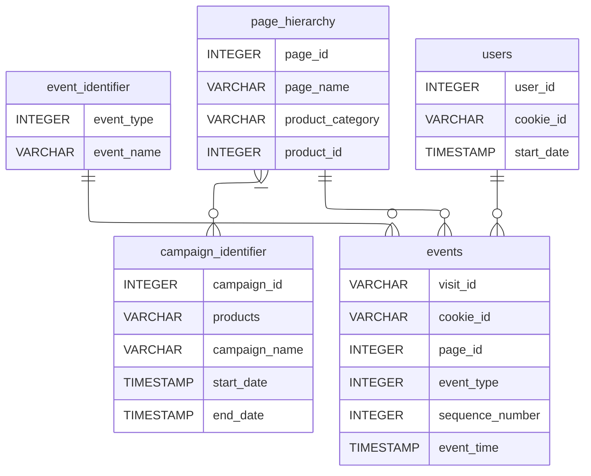

# Case Study #6 - Clique Bait


## Table of Contents

- [Problem Statement](#problem-statement)
- [Case Study Questions](#case-study-questions)
  - [1. Enterprise Relationship Diagram](#1-enterprise-relationship-diagram)
  - [2. Digital Analysis](#2-digital-analysis)
  - [3. Product Funnel Analysis](#3-product-funnel-analysis)
  - [4. Campaigns Analysis](#4-campaigns-analysis)
- [Links](#links)


## Problem Statement

Clique Bait is not like your regular online seafood store - the founder and CEO Danny, was also a part of a digital data analytics team and wanted to expand his knowledge into the seafood industry!

In this case study - you are required to support Danny’s vision and analyse his dataset and come up with creative solutions to calculate funnel fallout rates for the Clique Bait online store.


## Case Study Questions


### 1. Enterprise Relationship Diagram

Using the following DDL schema details to create an ERD for all the Clique Bait datasets:
``` sql
CREATE TABLE clique_bait.event_identifier (
  "event_type" INTEGER,
  "event_name" VARCHAR(13)
);

CREATE TABLE clique_bait.campaign_identifier (
  "campaign_id" INTEGER,
  "products" VARCHAR(3),
  "campaign_name" VARCHAR(33),
  "start_date" TIMESTAMP,
  "end_date" TIMESTAMP
);

CREATE TABLE clique_bait.page_hierarchy (
  "page_id" INTEGER,
  "page_name" VARCHAR(14),
  "product_category" VARCHAR(9),
  "product_id" INTEGER
);

CREATE TABLE clique_bait.users (
  "user_id" INTEGER,
  "cookie_id" VARCHAR(6),
  "start_date" TIMESTAMP
);

CREATE TABLE clique_bait.events (
  "visit_id" VARCHAR(6),
  "cookie_id" VARCHAR(6),
  "page_id" INTEGER,
  "event_type" INTEGER,
  "sequence_number" INTEGER,
  "event_time" TIMESTAMP
);
```



---

### 2. Digital Analysis

#### 1. How many users are there?
``` SQL
SELECT
	COUNT(DISTINCT user_id) AS total_users
FROM users;
```
| total_users |
| ----------: |
|         500 |


#### 2. How many cookies does each user have on average?
``` SQL
SELECT
	ROUND(AVG(cookies), 2) AS average_cookies
FROM (
	SELECT
		COUNT(cookie_id) AS cookies
	FROM users
	GROUP BY user_id
) AS cookie_count;
```
| average_cookies |
| --------------: |
|            3.56 |


#### 3. What is the unique number of visits by all users per month?
``` SQL
SELECT
	DATE_TRUNC('month', start_date)::DATE AS month,
	COUNT(cookie_id) AS visits
FROM users
GROUP BY month;
```
| month      | visits |
| ---------- | -----: |
| 2020-04-01 |    124 |
| 2020-01-01 |    438 |
| 2020-03-01 |    458 |
| 2020-05-01 |     18 |
| 2020-02-01 |    744 |


#### 4. What is the number of events for each event type?
``` SQL
SELECT
	event_name,
	COUNT(*) AS number_events
FROM events AS e
JOIN event_identifier AS i
ON e.event_type = i.event_type
GROUP BY event_name
ORDER BY number_events DESC;
```
| event_name    | number_events |
| ------------- | ------------: |
| Page View     |         20928 |
| Add to Cart   |          8451 |
| Purchase      |          1777 |
| Ad Impression |           876 |
| Ad Click      |           702 |


#### 5. What is the percentage of visits which have a purchase event?
``` SQL
SELECT
	ROUND(
		COUNT(DISTINCT visit_id) FILTER(WHERE event_type = 3)
		/
		COUNT(DISTINCT visit_id)::NUMERIC
		*
		100,
		2
	) AS percentage_purchase_visits
FROM events;
```
| percentage_purchase_visits |
| -------------------------: |
|                      49.86 |


#### 6. What is the percentage of visits which view the checkout page but do not have a purchase event?
``` SQL
SELECT
	ROUND(
		100
		-
		COUNT(DISTINCT visit_id) FILTER(WHERE event_type = 3)
		/
		COUNT(DISTINCT visit_id)::NUMERIC
		*
		100,
		2
	) AS percentage_purchase_visits
FROM events AS a
WHERE EXISTS(
	SELECT 1
	FROM events AS b
	WHERE a.visit_id = b.visit_id
	AND b.page_id = 12
);
```
| percentage_purchase_visits |
| -------------------------: |
|                      15.50 |


#### 7. What are the top 3 pages by number of views?
``` SQL
SELECT
	page_name,
	COUNT(*) AS views
FROM events AS e
JOIN page_hierarchy AS p
ON e.page_id = p.page_id
WHERE event_type = 1
GROUP BY page_name
ORDER BY views DESC
LIMIT 3;
```
| page_name    | views |
| ------------ | ----: |
| All Products |  3174 |
| Checkout     |  2103 |
| Home Page    |  1782 |


#### 8. What is the number of views and cart adds for each product category?
``` SQL
SELECT
	product_category,
	COUNT(*) FILTER(WHERE event_type = 1) AS views,
	COUNT(*) FILTER(WHERE event_type = 2) AS cart_adds
FROM events AS e
JOIN page_hierarchy AS p
ON e.page_id = p.page_id
AND product_category IS NOT NULL
GROUP BY product_category;
```
| product_category | views | cart_adds |
| ---------------- | ----: | --------: |
| Luxury           |  3032 |      1870 |
| Shellfish        |  6204 |      3792 |
| Fish             |  4633 |      2789 |


#### 9. What are the top 3 products by purchases?

This question required a bit more thought to complete. First I had to figure out how to determine whether a product had been purchased. 
I realized that some visitors would add items to their cart but never visit checkout, while others would visit checkout but never confirm their purchase.
To eliminate these, I would have to remove visits which don't have a purchase event. However, for this case study, I am assuming that once a purchase event takes place the visit is concluded and no more items will be added afterwards.

``` SQL
SELECT
	page_name AS product,
	COUNT(*) AS purchases
FROM events AS e
JOIN page_hierarchy AS p
ON e.page_id = p.page_id
-- Remove visits without a purchase event
WHERE EXISTS (
	SELECT 1
	FROM events AS b
	WHERE b.visit_id = e.visit_id
	AND event_type = 3
)
-- Remove product views
AND event_type = 2
-- Remove null products
AND product_category IS NOT NULL

GROUP BY page_name, product_id
HAVING product_id IS NOT NULL
ORDER BY purchases DESC
LIMIT 3;
```
| product | purchases |
| ------- | --------: |
| Lobster |       754 |
| Oyster  |       726 |
| Crab    |       719 |

---

### 3. Product Funnel Analysis

#### Using a single SQL query - create a new output table which has the following details:
  - How many times was each product viewed?
  - How many times was each product added to cart?
  - How many times was each product added to a cart but not purchased (abandoned)?
  - How many times was each product purchased?
    
``` SQL
CREATE TABLE product_analytics AS
SELECT
	page_name AS product,
	COUNT(*) FILTER(WHERE event_type = 1) AS views,
	
	COUNT(*) FILTER(WHERE event_type = 2) AS carted,
	
	COUNT(*) FILTER(WHERE NOT EXISTS(
		SELECT 1
		FROM events AS b
		WHERE b.visit_id = e.visit_id
		AND event_type = 3
		)
		AND event_type = 2
	) AS abandoned,
	
	COUNT(*) FILTER(WHERE EXISTS(
		SELECT 1
		FROM events AS b
		WHERE b.visit_id = e.visit_id
		AND event_type = 3
		)
		AND event_type = 2
	) AS purchases
	
FROM events AS e
JOIN page_hierarchy AS p
ON e.page_id = p.page_id

GROUP BY product_id, page_name
HAVING product_id IS NOT NULL;
```

| product        | views | carted | abandoned | purchases |
| -------------- | ----: | -----: | --------: | --------: |
| Salmon         |  1559 |    938 |       227 |       711 |
| Kingfish       |  1559 |    920 |       213 |       707 |
| Tuna           |  1515 |    931 |       234 |       697 |
| Russian Caviar |  1563 |    946 |       249 |       697 |
| Black Truffle  |  1469 |    924 |       217 |       707 |
| Abalone        |  1525 |    932 |       233 |       699 |
| Lobster        |  1547 |    968 |       214 |       754 |
| Crab           |  1564 |    949 |       230 |       719 |
| Oyster         |  1568 |    943 |       217 |       726 |


#### Additionally, create another table which further aggregates the data for the above points but this time for each product category instead of individual products.

``` SQL
CREATE TABLE category_analytics AS
SELECT
	product_category,
	SUM(views) AS views,
	SUM(carted) AS carted,
	SUM(abandoned) AS abandoned,
	SUM(purchases) AS purchases
	
FROM product_analytics AS a
JOIN page_hierarchy AS h
ON a.product = h.page_name

GROUP BY product_category;
```

| product_category | views | carted | abandoned | purchases |
| ---------------- | ----: | -----: | --------: | --------: |
| Luxury           |  3032 |   1870 |       466 |      1404 |
| Shellfish        |  6204 |   3792 |       894 |      2898 |
| Fish             |  4633 |   2789 |       674 |      2115 |


For these tables, the number of views represents the number of times a product is **ONLY** viewed. 
For a product to be carted, it will first have to be viewed but this isn't included in the views column.

To verify correctness, the number of times a product is carted should equal the sum of times purchased and abandoned; $carted = abandoned + purchases$


#### Use your 2 new output tables - answer the following questions:

##### 1. Which product had the most views, cart adds and purchases?
``` SQL
SELECT
    (ARRAY_AGG(product ORDER BY views DESC))[1] AS most_views,
    (ARRAY_AGG(product ORDER BY carted DESC))[1] AS most_carted,
    (ARRAY_AGG(product ORDER BY purchases DESC))[1] AS most_purchased
FROM product_analytics;
```
| most_views | most_carted | most_purchased |
| ---------- | ----------- | -------------- |
| Oyster     | Lobster     | Lobster        |


##### 2. Which product was most likely to be abandoned?
``` SQL
SELECT
	(ARRAY_AGG(product ORDER BY abandoned DESC))[1] AS most_abandoned
FROM product_analytics;
```
| most_abandoned |
| -------------- |
| Russian Caviar |


##### 3. Which product had the highest view to purchase percentage?
$$
\text{view purchase percentage} = \frac{purchases}{views + \text{cart adds}} * 100
$$
``` SQL
SELECT 
	product,
	view_purchase_percentage
FROM product_analytics AS a

JOIN LATERAL (
	SELECT
		ROUND(purchases / (views + carted)::NUMERIC * 100, 2) AS view_purchase_percentage
	FROM product_analytics
	WHERE product = a.product
) AS p ON TRUE

ORDER BY view_purchase_percentage DESC
LIMIT 1
```
| product | view_purchase_percentage |
| ------- | -----------------------: |
| Lobster |                    29.98 |

Lobster has the highest view to purchase ratio where 29.98% of views results in a purchase


##### 4. What is the average conversion rate from view to cart add?
$$
\text{conversion rate} = \frac{\text{cart adds}}{views + \text{cart adds}} * 100
$$
``` SQL
SELECT 
	ROUND(AVG(conversion_rate), 2) AS average_conversion_rate
FROM product_analytics AS a

JOIN LATERAL (
	SELECT
		carted / (views + carted)::NUMERIC * 100 AS conversion_rate
	FROM product_analytics
	WHERE product = a.product
) AS p ON TRUE;
```
| average_conversion_rate |
| ----------------------: |
|                   37.87 |

Therefore on average, 37.87% of views on a product result in it being added to a cart


##### 5. What is the average conversion rate from cart add to purchase?
$$
\text{conversion rate} = \frac{purchases}{\text{cart adds}} * 100
$$
``` SQL
SELECT 
	ROUND(AVG(conversion_rate), 2) AS average_conversion_rate
FROM product_analytics AS a

JOIN LATERAL (
	SELECT
		purchases / carted::NUMERIC * 100 AS conversion_rate
	FROM product_analytics
	WHERE product = a.product
) AS p ON TRUE;
```
| average_conversion_rate |
| ----------------------: |
|                   75.93 |

Therefore on average, 75.93% of products which are added to a cart get purchased

---

### 4. Campaigns Analysis

#### Generate a table that has 1 single row for every unique visit_id record and has the following columns:
  - user_id
  - visit_id
  - visit_start_time: the earliest event_time for each visit
  - page_views: count of page views for each visit
  - cart_adds: count of product cart add events for each visit
  - purchase: 1/0 flag if a purchase event exists for each visit
  - campaign_name: map the visit to a campaign if the visit_start_time falls between the start_date and end_date
  - impression: count of ad impressions for each visit
  - click: count of ad clicks for each visit
  - (Optional column) cart_products: a comma separated text value with products added to the cart sorted by the order they were added to the cart (hint: use the sequence_number)

``` SQL
CREATE TABLE visits AS 
SELECT
	user_id,
	visit_id,
	MIN(event_time) AS visit_start_time,
	COUNT(*) FILTER (WHERE event_type = 1) AS page_views,
	COUNT(*) FILTER (WHERE event_type = 2) AS cart_adds,
	BOOL_OR(event_type = 3)::INT AS purchase,
	campaign_name,
	COUNT(*) FILTER (WHERE event_type = 4) AS impression,
	COUNT(*) FILTER (WHERE event_type = 5) AS click,
	STRING_AGG(page_name, ', ' ORDER BY sequence_number) FILTER (WHERE event_type = 2) AS cart_products
	
FROM events AS e

JOIN users AS u
ON e.cookie_id = u.cookie_id

JOIN campaign_identifier AS c
ON e.event_time BETWEEN c.start_date AND c.end_date

JOIN page_hierarchy AS p
ON e.page_id = p.page_id

GROUP BY user_id, visit_id, campaign_name;
```

Here are all the visits where user_id = 1:

| user_id | visit_id | visit_start_time           | page_views | cart_adds | purchase | campaign_name                     | impression | click | cart_products                                                               |
| ------: | -------- | -------------------------- | ---------: | --------: | -------: | --------------------------------- | ---------: | ----: | --------------------------------------------------------------------------- |
|       1 | 02a5d5   | 2020-02-26 16:57:26.260871 |          4 |         0 |        0 | Half Off - Treat Your Shellf(ish) |          0 |     0 |                                                                             |
|       1 | 0826dc   | 2020-02-26 05:58:37.918618 |          1 |         0 |        0 | Half Off - Treat Your Shellf(ish) |          0 |     0 |                                                                             |
|       1 | 0fc437   | 2020-02-04 17:49:49.602976 |         10 |         6 |        1 | Half Off - Treat Your Shellf(ish) |          1 |     1 | Tuna, Russian Caviar, Black Truffle, Abalone, Crab, Oyster                  |
|       1 | 30b94d   | 2020-03-15 13:12:54.023936 |          9 |         7 |        1 | Half Off - Treat Your Shellf(ish) |          1 |     1 | Salmon, Kingfish, Tuna, Russian Caviar, Abalone, Lobster, Crab              |
|       1 | 41355d   | 2020-03-25 00:11:17.860655 |          6 |         1 |        0 | Half Off - Treat Your Shellf(ish) |          0 |     0 | Lobster                                                                     |
|       1 | ccf365   | 2020-02-04 19:16:09.182546 |          7 |         3 |        1 | Half Off - Treat Your Shellf(ish) |          0 |     0 | Lobster, Crab, Oyster                                                       |
|       1 | eaffde   | 2020-03-25 20:06:32.342989 |         10 |         8 |        1 | Half Off - Treat Your Shellf(ish) |          1 |     1 | Salmon, Tuna, Russian Caviar, Black Truffle, Abalone, Lobster, Crab, Oyster |
|       1 | f7c798   | 2020-03-15 02:23:26.312543 |          9 |         3 |        1 | Half Off - Treat Your Shellf(ish) |          0 |     0 | Russian Caviar, Crab, Oyster                                                |


#### Use the subsequent dataset to generate at least 5 insights for the Clique Bait team - bonus: prepare a single A4 infographic that the team can use for their management reporting sessions, be sure to emphasise the most important points from your findings.

##### 1. Identifying users who have received impressions during each campaign period and comparing each metric with other users who did not have an impression event
``` SQL
SELECT 
	campaign_name,
	'True' AS has_impressions,
	COUNT(visit_id) AS visitors,
	ROUND(AVG(page_views), 2) AS avg_page_views,
	ROUND(AVG(cart_adds), 2) AS avg_cart_adds,
	SUM(purchase) AS purchases,
	ROUND(AVG(impression), 2) AS avg_impressions,
	ROUND(AVG(click), 2) AS avg_clicks
FROM visits
WHERE impression > 0
GROUP BY campaign_name

UNION

SELECT 
	campaign_name,
	'False' AS has_impressions,
	COUNT(visit_id) AS visitors,
	ROUND(AVG(page_views), 2) AS avg_page_views,
	ROUND(AVG(cart_adds), 2) AS avg_cart_adds,
	SUM(purchase) AS purchases,
	ROUND(AVG(impression), 2) AS avg_impressions,
	ROUND(AVG(click), 2) AS avg_clicks
FROM visits
WHERE impression = 0
GROUP BY campaign_name

ORDER BY campaign_name, has_impressions DESC;
```
| campaign_name                     | has_impressions | visitors | avg_page_views | avg_cart_adds | purchases | avg_impressions | avg_clicks |
| --------------------------------- | --------------- | -------: | -------------: | ------------: | --------: | --------------: | ---------: |
| 25% Off - Living The Lux Life     | True            |      104 |           8.64 |          5.10 |        87 |            1.00 |       0.78 |
| 25% Off - Living The Lux Life     | False           |      300 |           5.12 |          1.54 |       115 |            0.00 |       0.00 |
| BOGOF - Fishing For Compliments   | True            |       65 |           8.77 |          5.35 |        55 |            1.00 |       0.85 |
| BOGOF - Fishing For Compliments   | False           |      195 |           4.95 |          1.42 |        72 |            0.00 |       0.00 |
| Half Off - Treat Your Shellf(ish) | True            |      578 |           8.51 |          5.01 |       493 |            1.00 |       0.80 |
| Half Off - Treat Your Shellf(ish) | False           |     1810 |           4.96 |          1.49 |       687 |            0.00 |       0.00 |


From this, we can see several stats:
- Most visitors don't have any ad impressions
- Visitors who have impressions typically view more pages
- Visitors who have impressions add significantly more to their carts
- Visitors who have impressions go though with purchases significantly more than those without


##### 2. Does clicking on an impression lead to higher purchase rates?
``` SQL
SELECT
	'True' AS has_clicked,
	COUNT(visit_id) AS visitors,
	SUM(purchase) AS purchases,
	ROUND(SUM(purchase) / COUNT(visit_id)::NUMERIC * 100, 2) AS purchase_rate
FROM visits
WHERE click > 0

UNION
	
SELECT
	'False' AS has_clicked,
	COUNT(visit_id) AS visitors,
	SUM(purchase) AS purchases,
	ROUND(SUM(purchase) / COUNT(visit_id)::NUMERIC * 100, 2) AS purchase_rate
FROM visits
WHERE click = 0;
```

| has_clicked | visitors | purchases | purchase_rate |
| ----------- | -------: | --------: | ------------: |
| False       |     2453 |       972 |         39.62 |
| True        |      599 |       537 |         89.65 |

Visitors who click on an impression have a much higher purchase rate than those who do not


##### 3. What is the uplift in purchase rate when comparing users who click on a campaign impression versus users who do not receive an impression? What if we compare them with users with just an impression but do not click?
``` SQL
SELECT
	click > 0 AS clicked,
	COUNT(visit_id) AS visitors,
	SUM(purchase) AS purchases,
	ROUND(SUM(purchase) / COUNT(visit_id)::NUMERIC * 100, 2) AS purchase_rate
FROM visits
GROUP BY clicked
ORDER BY purchase_rate DESC
```

| clicked | visitors | purchases | purchase_rate |
| ------- | -------: | --------: | ------------: |
| true    |      599 |       537 |         89.65 |
| false   |     2453 |       972 |         39.62 |

This tells us that visitors who click on a campaign impression have a purchase rate 50.03% higher than those who don't.

``` SQL
SELECT
	click > 0 AS clicked,
	impression > 0 AS impressioned,
	COUNT(visit_id) AS visitors,
	SUM(purchase) AS purchases,
	ROUND(SUM(purchase) / COUNT(visit_id)::NUMERIC * 100, 2) AS purchase_rate
FROM visits
GROUP BY clicked, impressioned
ORDER BY purchase_rate DESC
```

| clicked | impressioned | visitors | purchases | purchase_rate |
| ------- | ------------ | -------: | --------: | ------------: |
| true    | true         |      599 |       537 |         89.65 |
| false   | true         |      148 |        98 |         66.22 |
| false   | false        |     2305 |       874 |         37.92 |

When we include visitors who receive an impression, we can see that they have a purchase rate 28.3% higher than those who don't receive one. However, this is still 23.43% less than the purchase rate of visitors who click on an impression.

---

## Links

- All case study details, including the full problem statement, database diagram, and sample data used, can be found through the link:
	[8 Week SQL Challenge: Case Study #6 - Clique Bait](https://8weeksqlchallenge.com/case-study-6/)

- I have not seen the official solutions for this case study. If you have any questions or feedback on my solutions please contact me on my LinkedIn: 
	[Tom Melton](https://LinkedIn.com/in/tom-melton-23a59b353/)
